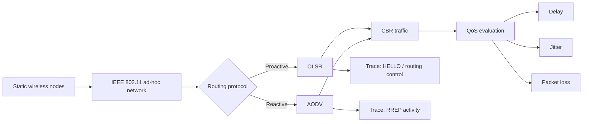

# Wireless Sensor Network Routing Simulation — NS-3

> Evidence-based portfolio case study for wireless ad-hoc routing, QoS analysis, and trace-level network behavior.

**Course:** Jaringan Sensor Nirkabel — Universitas Brawijaya  
**Project type:** Collaborative five-person final project  
**Portfolio owner:** Syifani Adillah Salsabila — Network Simulation Contributor  
**Simulation framework:** NS-3  
**Routing protocols:** OLSR and AODV  
**Traffic model:** Constant Bit Rate (CBR)

## Overview

This repository converts a final Wireless Sensor Network report into a recruiter-friendly engineering case study. The project used **NS-3** to study proactive and reactive routing behavior in a static wireless multi-hop network, with **OLSR** representing proactive routing and **AODV** representing reactive routing.

The retained report contains complete numerical QoS results for four OLSR scenarios, plus trace excerpts showing both **OLSR HELLO** control traffic and **AODV RREP** activity. It also describes a broader experiment matrix involving 25/50 nodes, 1/5 traffic sources, 100/1000-byte packets, and multiple nominal data-rate choices.

> **Evidence rule:** this portfolio distinguishes what was numerically measured, what is only visible in trace output, and what was planned in the experiment design but is not supported by complete retained results.

## Experiment model

## Verified QoS results

The report preserves four complete OLSR runs for **25 nodes**.

| Scenario | Protocol | Nodes | Packet size | Sources | Avg. delay | Avg. jitter | Packet loss |
|---|---|---:|---:|---:|---:|---:|---:|
| S1 | OLSR | 25 | 100 B | 1 | **0.957194 ms** | **0.100327 ms** | **0%** |
| S2 | OLSR | 25 | 100 B | 5 | **5.27994 ms** | **2.59068 ms** | **0%** |
| S3 | OLSR | 25 | 1000 B | 1 | **4.55978 ms** | **0.106106 ms** | **0%** |
| S4 | OLSR | 25 | 1000 B | 5 | **20.2444 ms** | **8.97887 ms** | **0%** |

Raw values are also stored in [`data/verified-results.csv`](data/verified-results.csv).

## What the measurements show

### More concurrent sources increased contention
Keeping packet size at 100 B, moving from **1 source → 5 sources** increased average delay from `0.957194 ms` to `5.27994 ms` and jitter from `0.100327 ms` to `2.59068 ms`.

### Larger packets increased transmission delay
With one active source, moving from **100 B → 1000 B** increased average delay from `0.957194 ms` to `4.55978 ms`, while jitter remained close to the original run (`0.100327 ms` vs `0.106106 ms`).

### Combined load produced the highest delay and jitter
The retained high-load OLSR case — **5 sources + 1000 B packets** — recorded `20.2444 ms` delay and `8.97887 ms` jitter. All four retained OLSR measurements report `0%` packet loss.

These are observations from this specific simulation setup, not universal OLSR performance claims.

## Trace-level evidence

The report includes packet-trace excerpts rather than only summary numbers.

**OLSR evidence** contains `ns3::olsr::MessageHeader` entries with `type: HELLO`, showing proactive routing-control traffic being transmitted and received across multiple nodes.

**AODV evidence** contains `ns3::aodv::TypeHeader (RREP)` and `ns3::aodv::RrepHeader`, showing reactive route-reply activity. One retained excerpt references node indices up to `NodeList/48`, providing trace-level evidence of an AODV run with a larger node population.

See [TRACE_ANALYSIS.md](TRACE_ANALYSIS.md).

## Evidence levels

| Claim | Evidence level |
|---|---|
| NS-3 used for the simulation | **Verified** |
| OLSR used as proactive routing | **Verified** |
| AODV used as reactive routing | **Verified / trace-backed** |
| Four OLSR 25-node QoS scenarios | **Verified numerically** |
| OLSR HELLO control messages | **Trace-verified** |
| AODV RREP activity | **Trace-verified** |
| 25- and 50-node experiment design | **Documented; partial trace support** |
| Complete numerical OLSR-vs-AODV comparison | **Not retained** |
| Complete 2-vs-5.5 Mbps comparison | **Not retained** |

## Important consistency note

The written experiment specification lists nominal data-rate choices of **2 Mbps / 5.5 Mbps**, while the retained trace excerpts show `DsssRate1Mbps`. Because of that mismatch, this portfolio does **not** claim a verified 2-vs-5.5 Mbps performance comparison. The discrepancy is documented in [LIMITATIONS.md](LIMITATIONS.md) and [docs/REPORT_CONSISTENCY_NOTES.md](docs/REPORT_CONSISTENCY_NOTES.md).

## Repository guide

- [Experiment design](EXPERIMENT_DESIGN.md)
- [Routing protocol notes](ROUTING_PROTOCOLS.md)
- [Verified results](RESULTS.md)
- [Trace analysis](TRACE_ANALYSIS.md)
- [QoS metric definitions](docs/QOS_METRICS.md)
- [Evidence map](docs/EVIDENCE_MAP.md)
- [Reproducibility notes](docs/REPRODUCIBILITY.md)
- [Report consistency notes](docs/REPORT_CONSISTENCY_NOTES.md)
- [Team attribution](TEAM_ATTRIBUTION.md)
- [Source evidence](SOURCE_EVIDENCE.md)
- [Portfolio / CV copy](PORTFOLIO.md)
- [Limitations](LIMITATIONS.md)

## Team

This was collaborative coursework completed by:

- Syifani Adillah Salsabila
- Muhammad Omar Haqqi
- Aldura Armanu Shaufa Imron
- Ahmad Adzka Najhan
- Muhammad Arif Rifki

The public portfolio intentionally omits student identification numbers. It also does not claim that any one member authored every simulation artifact or report section.

## Public repository policy

The raw academic PDF is not republished here. This repository contains sanitized summaries, verified numerical results, and short representative trace excerpts only. If original `.cc`, `.tr`, FlowMonitor, or plotting artifacts are recovered later, they can be added while preserving provenance and team attribution.
