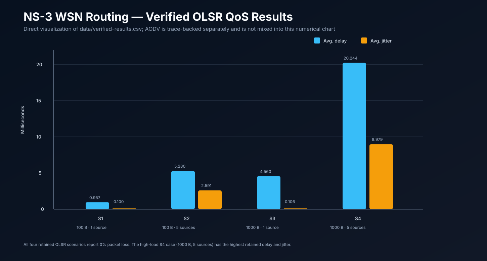
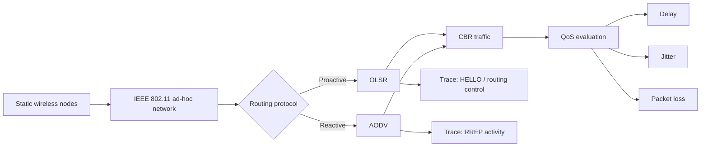

# Wireless Sensor Network Routing Simulation — NS-3

> Evidence-based portfolio case study for wireless ad-hoc routing, QoS analysis, and trace-level network behavior.

**Course:** Jaringan Sensor Nirkabel — Universitas Brawijaya  
**Project type:** Collaborative five-person final project  
**Portfolio owner:** Syifani Adillah Salsabila — Network Simulation Contributor  
**Simulation framework:** NS-3  
**Routing protocols:** OLSR and AODV  
**Traffic model:** Constant Bit Rate (CBR)

## Overview

This repository converts a final Wireless Sensor Network report into a recruiter-friendly engineering case study. The project used **NS-3** to study proactive and reactive routing behavior in a static wireless multi-hop network, with **OLSR** representing proactive routing and **AODV** representing reactive routing.

The retained evidence is intentionally separated by strength: the final report preserves complete numerical QoS results for four **OLSR / 25-node** scenarios; trace excerpts show **OLSR HELLO** control traffic and **AODV RREP** activity; a broader 25/50-node and 2/5.5-Mbps matrix is documented in the experiment design but is not fully preserved numerically.

> **Evidence rule:** measured data, trace-only evidence, and design-only claims are never blended into one result table.

## Real retained QoS data

  

The chart is derived directly from [`data/verified-results.csv`](./data/verified-results.csv). It visualizes only the four numerical OLSR scenarios actually retained in the final report; AODV is deliberately excluded from the chart because its surviving evidence is trace-level rather than a complete comparable result set.

| Scenario | Protocol | Nodes | Packet size | Sources | Avg. delay | Avg. jitter | Packet loss |
|---|---|---:|---:|---:|---:|---:|---:|
| S1 | OLSR | 25 | 100 B | 1 | **0.957194 ms** | **0.100327 ms** | **0%** |
| S2 | OLSR | 25 | 100 B | 5 | **5.27994 ms** | **2.59068 ms** | **0%** |
| S3 | OLSR | 25 | 1000 B | 1 | **4.55978 ms** | **0.106106 ms** | **0%** |
| S4 | OLSR | 25 | 1000 B | 5 | **20.2444 ms** | **8.97887 ms** | **0%** |

## Senior technical review path

A reviewer can verify the project through the evidence instead of relying on portfolio prose:

1. **Experiment model:** [EXPERIMENT_DESIGN.md](./EXPERIMENT_DESIGN.md) — nodes, traffic matrix, packet sizes, routing choices, and intended QoS metrics.
2. **Routing behavior:** [ROUTING_PROTOCOLS.md](./ROUTING_PROTOCOLS.md) — proactive OLSR vs reactive AODV and the expected control-plane trade-offs.
3. **Measured QoS:** [`data/verified-results.csv`](./data/verified-results.csv), [RESULTS.md](./RESULTS.md), and [docs/QOS_METRICS.md](./docs/QOS_METRICS.md).
4. **Trace evidence:** [TRACE_ANALYSIS.md](./TRACE_ANALYSIS.md) and [`examples/trace-snippets.md`](./examples/trace-snippets.md) — OLSR HELLO and AODV RREP activity.
5. **Reproducibility boundary:** [docs/REPRODUCIBILITY.md](./docs/REPRODUCIBILITY.md) and [`scripts/validate_results.py`](./scripts/validate_results.py).
6. **Evidence/provenance:** [docs/EVIDENCE_MAP.md](./docs/EVIDENCE_MAP.md), [SOURCE_EVIDENCE.md](./SOURCE_EVIDENCE.md), [docs/REPORT_CONSISTENCY_NOTES.md](./docs/REPORT_CONSISTENCY_NOTES.md), [TEAM_ATTRIBUTION.md](./TEAM_ATTRIBUTION.md), and [LIMITATIONS.md](./LIMITATIONS.md).

## Experiment model

## What the retained measurements show

### More concurrent sources increased delay and jitter
With 100-byte packets, moving from **1 source to 5 sources** increased average delay from `0.957194 ms` to `5.27994 ms` and jitter from `0.100327 ms` to `2.59068 ms` in the retained OLSR runs.

### Larger packets increased delay in the single-source case
At one source, moving from **100 B to 1000 B** increased average delay from `0.957194 ms` to `4.55978 ms`. Jitter remained close in those two retained scenarios (`0.100327 ms` vs `0.106106 ms`).

### Combined load produced the highest retained delay and jitter
The **1000 B + 5-source** OLSR case recorded `20.2444 ms` average delay and `8.97887 ms` average jitter. All four retained OLSR scenarios report `0%` packet loss.

These are observations from this particular simulation setup, not universal OLSR performance claims.

## Trace-level routing evidence

The report retains control-plane trace snippets rather than only summary metrics:

- **OLSR:** `ns3::olsr::MessageHeader` with `type: HELLO`, supporting proactive periodic neighbor/control activity.
- **AODV:** `ns3::aodv::TypeHeader (RREP)` and `ns3::aodv::RrepHeader`, supporting reactive route-reply behavior.
- one AODV excerpt references node indices up to `NodeList/48`, which is consistent with a larger-node run being exercised, but it is not a substitute for a complete numerical 50-node comparison.

This distinction is important: the repository can support “AODV was executed and produced reactive routing traces,” but not “AODV outperformed OLSR” from the currently retained evidence.

## Automated result-integrity validation

[`scripts/validate_results.py`](./scripts/validate_results.py) runs in GitHub Actions on pushes and pull requests. It checks that:

- the numerical dataset still contains exactly S1–S4;
- every retained numerical row remains OLSR with 25 nodes;
- packet sizes and source counts remain aligned with the retained matrix;
- delay and jitter values have not drifted;
- all four retained rows preserve the report's `0%` packet-loss result;
- AODV is not silently added as a numerical claim without retained comparable measurements.

The workflow validates **portfolio data integrity**, not the NS-3 simulator runtime itself.

## Evidence levels

| Claim | Evidence level |
|---|---|
| NS-3 used for the simulation | **Verified** |
| OLSR used as proactive routing | **Verified** |
| AODV used as reactive routing | **Trace-backed** |
| Four OLSR 25-node QoS scenarios | **Verified numerically** |
| OLSR HELLO control messages | **Trace-verified** |
| AODV RREP activity | **Trace-verified** |
| 25- and 50-node experiment design | **Documented; partial trace support** |
| Complete numerical OLSR-vs-AODV comparison | **Not retained** |
| Complete 2-vs-5.5 Mbps comparison | **Not retained** |

## Important consistency note

The written experiment specification lists nominal data-rate choices of **2 Mbps / 5.5 Mbps**, while retained traces show `DsssRate1Mbps`. Because of that mismatch, this portfolio does **not** claim a verified 2-vs-5.5 Mbps performance comparison. The discrepancy remains explicit in [LIMITATIONS.md](./LIMITATIONS.md) and [docs/REPORT_CONSISTENCY_NOTES.md](./docs/REPORT_CONSISTENCY_NOTES.md).

## Team and attribution

This was collaborative coursework completed by:

- Syifani Adillah Salsabila
- Muhammad Omar Haqqi
- Aldura Armanu Shaufa Imron
- Ahmad Adzka Najhan
- Muhammad Arif Rifki

The public portfolio intentionally omits student identification numbers and does not claim that one member authored every simulation artifact or report section.

## Public repository policy

The raw academic PDF is not republished here. This repository contains sanitized summaries, verified numerical results, short representative trace excerpts, and explicit evidence boundaries. If original `.cc`, `.tr`, FlowMonitor, or plotting artifacts are recovered later, they can be added while preserving provenance and team attribution.
